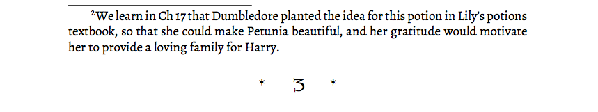

HPMOR
=====

LaTeX/PDF version of “Harry Potter and the Methods of Rationality” -- with annotations to highlight foreshadowing.

HPMOR has lots of foreshadowing that rewards repeated reading. This fork adds annotations meant to highlight clever foreshadowing, for example in Chapter 1:

...

- Feel free to pull-request your own annotations / hints. Use the `hint{}` macro in `new-chapters/hpmor-chapter-001.tex` and other chapters.
- I commented-out the PDF covers because I intend to print my own hard-copies through <lulu.com> using the method described by  <https://github.com/ianstormtaylor/hpmor>.

README forked from rjl20
=========================

This fork incorporates changes made to the chapters after they were added to 
the PDF. Chapter 9, for example, has had a large chunk moved to the 
"Omake Files" chapter since it was first published, due to reader reactions.
Other chapters have had significant changes made in order to work with later
chapters as they were written. Because the PDF conversion was a manual process,
few of these changes were reflected in the PDF until now.

Files
=====

* hpmor.tex - the main file
* hp-format.tex - mostly set up memoir
* hp-hacks.tex - all sorts of formatting commands used in the text
* new-chapters/ - one file per chapter, included from hpmor.tex
* chapters/ - one file per chapter, the original files before my fork
* out/ - generated files are put here, including the main output, hpmor.pdf
* pkg/ - some latex packages that might be tricky to find
* xfonts/ - the various fonts used
* Makefile - use "make" to build the full PDF, "make all" to build the full PDF and all six sub-books, and "make clean" to clean up. "make hpmor-N.pdf", where N is an integer from 1 through 6, will build just that sub-book.

Contributing
============

If you'd like to help, the files to edit are in new-chapters/. 

NB: I've moved the Omake Files chapters (11 and 64) to the end of the PDF. Those chapter 
numbers are omitted in the text, so chapter 10 is followed by chapter 12, for example.
In the sub-book PDFs, all chapters are renumbered to start from 1 at the start of a book,
and there are no appendices.

